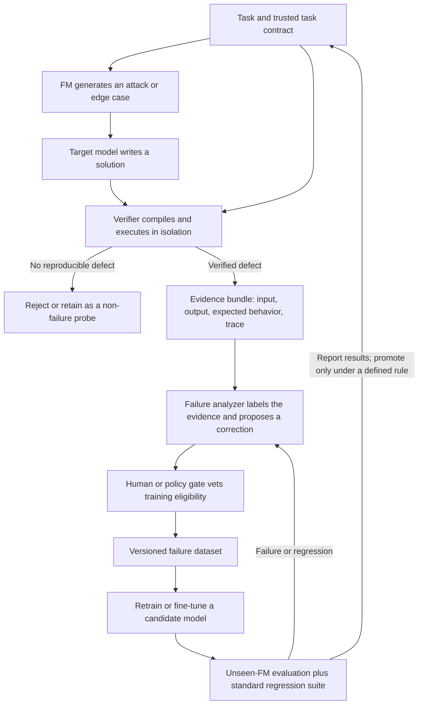

# FAILURE MODELS (FMs)

> **Break it before the world does.**

Models are usually trained to imitate success. Then the world supplies the edge case nobody thought to include.

**Failure-Driven AI turns those edge cases into the training signal.** One model attempts to make another fail. A verifier decides whether the failure is real. The evidence is recorded, analyzed, and used to improve the target. Then a different attacker gets a turn.

This repository is the design and research plan for that system. The first implementation targets code generation, where programs can be compiled, executed, and checked against independent tests. The claim is a hypothesis to test, not a result we get to assume: **does learning from verified failures improve performance on failures from an attacker the model has never trained against, while preserving ordinary capability?**

---

## The enemy is the blind spot

A model can look excellent on familiar examples and still fail when a small detail changes: an empty input, a duplicate value, a large number, an unexpected encoding, a boundary condition, a conflicting requirement, or an adversarially chosen test.

Those failures are expensive because they are often discovered late: in production, in a security review, or by a user who never agreed to be part of the experiment. Finding them after deployment gives us a bug report. Finding them before deployment gives us evidence we can learn from.

The core question is not just **“Can the model solve this task?”** It is:

> **“What is the smallest, clearest, independently verified counterexample to the model’s confidence—and can we make the next version handle it?”**

## Why ordinary training is not enough

Conventional supervised training is essential. It teaches a model what good answers look like. But a success-only dataset has a structural blind spot: it says little about how the model fails just beyond the examples it has seen.

Common evaluation can share that blind spot. If the same task patterns, test styles, or assumptions shape training and evaluation, a score can rise without the model becoming more robust to unfamiliar attacks. Random splits alone do not prevent near-duplicate problems or leaked tests from crossing the boundary.

Failure-driven training adds a complementary signal: verified examples of a target’s weak spots, paired with evidence and a vetted correction. It does **not** make ordinary training obsolete, and it does not guarantee that robustness transfers. Transfer is the experiment.

## Meet the FMs

**FM means Failure Model.** An FM is an adversarial generator whose job is to expose a target model’s weaknesses, not to help it succeed. It proposes difficult tasks, inputs, edge cases, transformations, or tests that a target is likely to mishandle.

An FM can be a language model, a search procedure, a fuzzer, a mutation engine, a collection of hand-built heuristics, or a combination of these. The name describes its role in the system, not a requirement that every attacker be a neural network.

FMs can specialize in different ways:

- **Boundary FM:** empty, singleton, maximum-size, and off-by-one cases.
- **Adversarial-input FM:** duplicates, ordering, unusual values, malformed data, and hostile encodings.
- **Constraint FM:** hidden requirements, interacting constraints, and ambiguous specifications.
- **Mutation FM:** changes a task, candidate program, or test while preserving useful structure.
- **Property FM:** proposes invariants and metamorphic relations that should hold across related inputs.
- **Novelty FM:** searches for cases that differ from the failure corpus and current evaluation pool.

An FM proposes. It does not certify. A clever-sounding attack that does not reproduce is not a failure.

## The adversarial loop



### The roles

1. **Task contract** — defines the problem, interface, constraints, and trusted oracle or properties. It is the source of truth for verification.
2. **Target model** — produces the code being evaluated. Keep its model version, prompt, decoding settings, and output intact for reproducibility.
3. **FM attacker** — searches for a task instance or input likely to trigger a defect. Track FM identity and version so training and evaluation attackers can be separated.
4. **Verifier** — compiles and runs the candidate under resource and security limits, then compares its behavior with the task contract. It returns evidence and a verdict, not a persuasive narrative.
5. **Failure analyzer** — classifies the failure, summarizes the causal pattern, and may propose corrected code or a repair. Its explanation is a hypothesis; the verifier must independently validate any proposed correction.
6. **Failure dataset** — stores the original task, attack, failed attempt, verification evidence, labels, and vetted correction as a versioned record.
7. **Trainer and evaluator** — builds a candidate from eligible records, then measures it against frozen, disjoint attackers and a standard capability suite.

## Design principles: rules of the arena

1. **Evidence outranks eloquence.** A plausible explanation is not a verified failure.
2. **The verifier is the referee.** FM output and analyzer output are untrusted proposals until checked against the task contract.
3. **Reproduce before recording.** Keep enough environment and execution detail to replay the failure.
4. **Separate discovery from judgment.** The attacker searches; the verifier decides; the analyzer interprets.
5. **Make the attack earn its keep.** Prefer minimal, novel counterexamples over piles of redundant failures.
6. **Train on the weakness, not the leak.** Do not expose held-out tests, evaluator outputs, or test-only corrections to training.
7. **Measure transfer, not memorization.** Reserve attacker families, task families, and test cases that never influence fine-tuning or tuning choices.
8. **Keep the old score honest.** Adversarial gains do not count as a win if ordinary capability or other safety properties collapse.
9. **Version every moving part.** Models, prompts, FMs, verifier rules, datasets, and training runs need stable identifiers.
10. **Report uncertainty.** Use repeated runs or confidence intervals where practical; a single lucky score is not a law of nature.
11. **Treat generated code as hostile.** Execute it with strict isolation, timeouts, memory limits, and no unnecessary network or filesystem access.
12. **Do not promise compounding.** Each iteration is a hypothesis. Keep it only if evaluation supports the improvement.

## Failure taxonomy

Every verified failure should receive one primary label and may receive secondary labels. The initial code-generation taxonomy:

| Category | Typical symptom |
|---|---|
| Boundary condition | Empty input, singleton input, off-by-one indexing, or incorrect inclusive/exclusive bound |
| Input-shape assumption | Assumes sorted, unique, non-empty, or well-formed input without contractual support |
| Algorithmic logic | Wrong recurrence, invariant, branch, or state transition |
| Numeric behavior | Overflow, precision loss, wrong sign handling, or incorrect numeric limits |
| Complexity failure | Correct on small cases but exceeds the allowed time or memory on scale |
| Parsing and formatting | Incorrect tokenization, whitespace handling, output format, or encoding assumption |
| State and mutation | Unexpected shared state, mutation, order dependence, or failure across repeated calls |
| Constraint interaction | Satisfies requirements individually but fails when requirements interact |
| Security-relevant behavior | Unsafe parsing, injection surface, resource exhaustion, or other policy-defined vulnerability |
| Specification ambiguity | Multiple plausible interpretations; record as ambiguity unless the contract resolves it |
| Invalid or non-reproducible | Does not compile, cannot be replayed, lacks a trusted oracle, or is not a target defect |

The last category matters. A failed run is not automatically a useful training example. Invalid tasks, infrastructure faults, flaky tests, and incorrect oracles should be tracked separately from confirmed target failures.

## Conceptual architecture

```text
┌──────────────────────────── Research control plane ────────────────────────────┐
│  Task registry · model/attacker versions · dataset policy · run configuration  │
└────────────────────────────────────┬───────────────────────────────────────────┘
                                     │
         ┌───────────────────────────▼────────────────────────────┐
         │ FM pool: generate, mutate, fuzz, and deduplicate probes │
         └───────────────────────────┬────────────────────────────┘
                                     │ attack + task
         ┌───────────────────────────▼────────────────────────────┐
         │ Target model: produce candidate code                   │
         └───────────────────────────┬────────────────────────────┘
                                     │ candidate
         ┌───────────────────────────▼────────────────────────────┐
         │ Isolated verifier: compile · execute · compare · replay │
         └───────────────────────────┬────────────────────────────┘
                              verdict + evidence
         ┌───────────────────────────▼────────────────────────────┐
         │ Analyzer: taxonomy · minimal case · vetted repair       │
         └───────────────────────────┬────────────────────────────┘
                                     │ eligible record
         ┌───────────────────────────▼────────────────────────────┐
         │ Versioned corpus → fine-tuning → frozen evaluation      │
         └────────────────────────────────────────────────────────┘
```

The control plane must distinguish **discovery data**, **training data**, **validation data**, and **sealed evaluation data**. A shared database is acceptable only if access rules preserve that boundary. Evaluation results must not silently flow back into training.

## Failure record: conceptual schema

The schema is a starting contract, not a commitment to a specific storage format. Store large logs and artifacts by immutable reference; keep the core record queryable and privacy-conscious.

```json
{
  "record_id": "stable-unique-id",
  "status": "verified_failure",
  "task": {
    "task_id": "task-family-and-version",
    "contract": "problem statement, interface, constraints",
    "oracle_ref": "trusted solution or property suite reference",
    "language": "python",
    "split": "train"
  },
  "attack": {
    "fm_id": "boundary-fm",
    "fm_version": "version-or-commit",
    "strategy": "edge-case generation",
    "seed": 1729,
    "input_ref": "immutable attack input",
    "provenance": "generated, mutated, fuzzed, or curated"
  },
  "target": {
    "model_id": "model-and-checkpoint",
    "prompt_hash": "hash-of-exact-prompt",
    "decoding": {"temperature": 0, "seed": 11},
    "output_ref": "exact generated code"
  },
  "verification": {
    "verifier_version": "version-or-commit",
    "verdict": "confirmed_mismatch",
    "expected_ref": "expected result or property evidence",
    "actual_ref": "observed result",
    "reproduction_command_ref": "replay configuration",
    "exit_status": 0,
    "runtime_ms": 4,
    "resource_limits": {"time_ms": 2000, "memory_mb": 256}
  },
  "analysis": {
    "primary_category": "boundary_condition",
    "secondary_categories": ["input_shape_assumption"],
    "summary": "short evidence-grounded explanation",
    "repair_ref": "candidate correction",
    "repair_verified": true
  },
  "dataset": {
    "eligible_for_training": true,
    "exclusion_reason": null,
    "dedup_cluster": "semantic-family-key",
    "created_at": "timestamp",
    "dataset_version": "corpus-version"
  }
}
```

The schema preserves **what the FM asked**, **what the target returned**, **what the verifier observed**, and **what the analyzer inferred** as separate facts. This makes it possible to audit a record or exclude a bad label without rewriting history.

## From a verified failure to training data

The useful unit is not just a broken answer. It is a traceable tuple:

```text
(task contract, adversarial condition, failed output, verification evidence,
 failure label, vetted correction, provenance, split eligibility)
```

The correction can be a verified repaired program, a targeted patch, or a supervised explanation paired with corrected code. For an MVP, start with supervised fine-tuning or parameter-efficient fine-tuning of a capable code model. Do not imply that a small corpus trains a foundation model from scratch.

Before admission to training, check that the task is valid, the target failure reproduces, the expected behavior comes from a trusted source, and the repair passes the verifier. Deduplicate by both exact hashes and semantic task/failure families. Keep all provenance so suspicious records can be removed and runs reconstructed.

## The experiment that matters

### Question

> **Does fine-tuning on verified failures found by training FMs improve the target’s performance on unseen failures from held-out FMs, without unacceptable regressions on standard code tasks?**

### Protocol

1. **Choose and freeze a target.** Record its checkpoint, prompt, decoding settings, and execution budget.
2. **Build task families.** Define trusted task contracts and independently validated oracles. Group related tasks before splitting.
3. **Partition before discovery.** Separate training, validation, and sealed evaluation by task family, attack template, and FM family where possible. Deduplicate across splits before any fine-tuning.
4. **Capture a baseline.** Run the target on the standard suite and a sealed adversarial suite before training.
5. **Discover training failures.** Let only training FMs search training-eligible task families. Verify and classify candidate failures.
6. **Construct the treatment data.** Admit only valid, reproducible failures with trusted expectations and verified repairs. Record exclusions as well as inclusions.
7. **Fine-tune.** Use a documented recipe. Keep compute, target base checkpoint, and selection policy controlled.
8. **Select on validation only.** Use validation for hyperparameters and checkpoints; never use the sealed evaluation score to choose a run.
9. **Evaluate once the policy is frozen.** Compare baseline and candidate on the same sealed task and attacker sets, including an FM family never used for training or tuning.
10. **Report the complete result.** Include overall and category metrics, standard-benchmark regressions, failed or invalid probes, run variance, and limitations.

### Metrics

| Metric | What it tells us |
|---|---|
| Verified pass rate under held-out FMs | Primary measure of transfer to unseen adversarial generation |
| Failure rate by taxonomy category | Shows which weaknesses improved and which remain |
| Standard-suite pass rate / pass@k | Detects loss of ordinary code-generation ability |
| Training-FM versus held-out-FM gap | Indicates how much improvement may be attacker-specific |
| Unique verified failures per attack budget | Measures useful discovery yield, not just raw generation volume |
| Verification precision and invalid-probe rate | Measures whether the pipeline distinguishes real failures from noise |
| Repair acceptance rate | Share of proposed repairs that pass independent verification |
| Regression rate | Share of previously passing cases broken by the new candidate |
| Cost per unique verified failure | Tracks the practical cost of finding useful training signal |

Always give denominators and the test protocol. Report score changes in percentage points alongside raw counts. When the evaluation set is small, show uncertainty rather than presenting a fragile point estimate as certainty.

## Anti-gaming and leakage controls

An adversarial loop can accidentally teach a model the test, reward a weak verifier, or inflate a score by counting duplicates. These are first-class system risks.

- Freeze evaluation cases and their expected outputs outside the training pipeline. Restrict access; log every evaluation run.
- Split by task family and attacker family, not only by individual row. Keep related variants and near-duplicates in the same partition.
- Hash exact inputs and outputs; use similarity checks and manual audits for semantic leakage.
- Reserve at least one FM family and attack strategy from all training and tuning. A renamed or reprompted training FM is not an unseen attacker.
- Version prompts, seeds, models, task generators, verifier code, and container images. Make failures replayable.
- Require the verifier to use a trusted oracle or independent property. Never treat an FM’s expected answer as ground truth by default.
- Keep the analyzer blind to sealed expected outputs when generating candidate fixes. Verify corrections independently.
- Track false positives, flaky tests, timeouts, compiler errors, and infrastructure failures separately. Do not relabel them as target logic failures without evidence.
- Evaluate with hidden test cases and varied input generation so models cannot pass by memorizing visible examples.
- Do not let an attacker choose the metric, alter the verifier, or see sealed tests. The attack budget and scoring rule must be fixed in advance.
- Report every attempted evaluation run and predefine how repeated runs or best-of-N generation are scored.
- Audit for benchmark contamination and record known limitations. A clean split in our corpus cannot prove a pretrained model never saw a public task.

## MVP: start where the referee can see

The first version focuses on **code generation** because correctness can often be checked objectively and repeatedly. Keep the first loop narrow enough to inspect end to end:

1. A small set of trusted programming tasks with explicit input/output contracts.
2. One fixed target code model and one standard prompting recipe.
3. Two or more distinct training FMs, such as a model-based edge-case generator and a property/fuzzing strategy.
4. A sandboxed compile-and-run verifier with time and memory limits.
5. A compact failure taxonomy and a human-auditable failure record.
6. Verified repair examples and a documented fine-tuning run.
7. A frozen evaluation suite generated by a separate FM family.
8. A concise before/after report covering adversarial transfer and standard-suite regression.

The first demo should show one case moving through the loop: **FM attack → target failure → verifier evidence → vetted correction → candidate improvement → held-out check.** Show the evidence and the split boundaries, not just an animated score climbing.

## Roadmap

### Phase 0 — Specify the experiment

Finalize task contracts, the record schema, failure labels, and split policy. Establish baseline and evaluation rules before training.

### Phase 1 — Build a trustworthy code loop

Implement task loading, FM interfaces, target adapters, isolated execution, verification, reproducible records, and failure review.

### Phase 2 — Measure discovery quality

Compare FMs on unique verified failure yield, category coverage, cost, and reproducibility. Add deduplication and attack-budget tracking.

### Phase 3 — Run the learning test

Create a vetted correction set, fine-tune a candidate, and compare against the unchanged target on sealed held-out FMs and standard benchmarks.

### Phase 4 — Harden and reproduce

Repeat across seeds or runs, publish the exact protocol and limitations, investigate regressions, and retain only improvements that survive the predeclared evaluation.

### Later domains

- **Math:** symbolic checks, numerical tolerances, proof obligations, and independently checked solutions.
- **Reasoning:** controlled tasks with explicit answer criteria and checks that distinguish reasoning failure from ambiguous prompts.
- **Security:** exploit generation in authorized sandboxes, patch verification, and threat-model-specific evaluation.
- **Factuality:** source-grounded claims, provenance checks, temporal snapshots, and citation verification.

Each domain needs its own oracle strategy and safety boundary. Reusing the name “failure-driven” does not make a verifier objective where the task itself is subjective.

## Project philosophy

**Failure is not a shame signal. It is a measurement.** A model that fails is useful evidence; a system that hides, mislabels, or memorizes that evidence is not.

We want attacks that are hard, evidence that is inspectable, corrections that are checked, and results that survive contact with an attacker the training loop did not control. We will not call every red team prompt a discovery, every passed test a proof of safety, or every improved score a general breakthrough.

The implementation details matter: the quality and diversity of FM-generated failures, the independence of verification, the provenance and usefulness of training examples, the isolation of evaluation, and the empirical results. The broader ingredients have precedents across adversarial training, fuzzing, data-centric learning, and automated testing. The project earns its claims through its implementation and measurements.

**Find the crack. Prove it is real. Teach the model to close it. Bring a new attacker.**

---

## Project status

This repository currently contains the project manifesto and research plan. The MVP loop, verifier, dataset, and evaluation results remain to be implemented and measured. No robustness result is claimed by this document.
