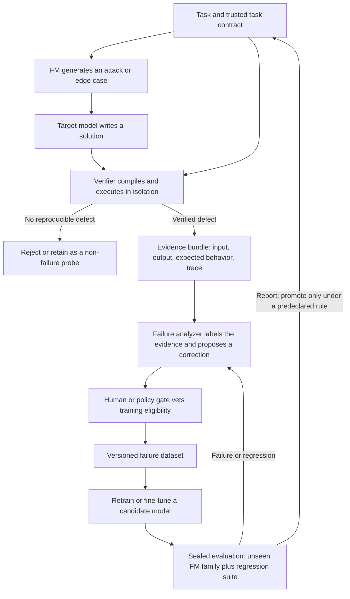

# Track A — Research: the FM loop

> **Break it before the world does. Then prove the break was real.**

This is the research half of the project. For the unifying argument and the
prior art, read [../docs/thesis.md](../docs/thesis.md) first. **For measured
results, read [../RESULTS.md](../RESULTS.md).**

**Status: instrument built and validated. Primary hypothesis untested.**

What exists: the loop, a four-verdict exogenous verifier, three training FMs
plus a held-out FM, the acceptance gate, and a live model adapter. Validated
offline against targets with documented weaknesses, and against live models
where a control confirms injected bugs are caught.

What does not exist: a fine-tuned model, or any transfer measurement. A live
sweep across three models produced 40 probe hits resolving to **4 distinct
failures** — all signature/arity confusion, which is too narrow to demonstrate
generalization. `sealed_eval` is empty.

---

## Read this first: the loop is prior art

The attack-verify-correct-retest structure below is a self-play adversarial
training loop. It has been instantiated at least five times, including GPT-Red
(OpenAI, closed), "Learning from Failure" (arXiv 2606.31270, which uses the
phrase "failure-driven self-improvement loop" for computer-use agents), SWE-smith
(arXiv 2504.21798), FeatAdd (ICLR 2026), and the full survey in "Self-Evolving
Coding Agents" (arXiv 2608.03392).

A paper proposing this loop will not survive review. The contribution is
narrower and stated in [thesis.md §4](../docs/thesis.md#4-what-our-contribution-actually-is):

> Demonstrate in the one domain where the verifier is exogenous by construction
> that a failure-driven loop produces **real transfer** — with the data-handling
> and acceptance-gate discipline that SEAL and "Agent Hacks Agent" specify, and
> which existing LLM-judge-based instantiations cannot implement.

Everything below is the experimental apparatus for making that claim honestly.

---

## The enemy is the blind spot

A model can look excellent on familiar examples and still fail when one detail
changes: an empty input, a duplicate value, a large number, an unexpected
encoding, a boundary condition, a conflicting requirement, an adversarially
chosen test.

Those failures are expensive because they are usually found late — in
production, in a security review, or by a user who never agreed to be part of
the experiment. Finding them after deployment gives us a bug report. Finding
them before deployment gives us evidence we can learn from.

The core question is not "can the model solve this task?" It is:

> **What is the smallest, clearest, independently verified counterexample to the
> model's confidence — and can we make the next version handle it?**

## Why ordinary training is not enough

Supervised training teaches a model what good answers look like. A success-only
dataset has a structural blind spot: it says little about how the model fails
just past the edge of what it has seen.

Ordinary evaluation can share that blind spot. If the same task patterns, test
styles, or assumptions shape training and evaluation, a score can rise without
the model becoming more robust. Random splits do not prevent near-duplicate
problems or leaked tests from crossing the boundary.

Failure-driven training adds a complementary signal: verified examples of a
target's weak spots, paired with evidence and a vetted correction. It does not
make ordinary training obsolete, and it does not guarantee transfer. **Transfer
is the experiment.**

---

## Meet the FMs

**FM means Failure Model.** An FM is an adversarial generator whose job is to
expose weaknesses, not to help. It proposes difficult tasks, inputs, edge
cases, transformations, or tests a target is likely to mishandle.

An FM can be a language model, a search procedure, a fuzzer, a mutation
engine, hand-built heuristics, or a combination. The name describes its role
in the system, not a requirement that every attacker be a neural network.

FM specializations in the initial taxonomy:

- **Boundary FM** — empty, singleton, maximum-size, off-by-one cases.
- **Adversarial-input FM** — duplicates, ordering, unusual values, malformed
  data, hostile encodings.
- **Constraint FM** — hidden requirements, interacting constraints, ambiguous
  specifications.
- **Mutation FM** — alters a task, candidate program, or test while preserving
  useful structure.
- **Property FM** — proposes invariants and metamorphic relations that should
  hold across related inputs.
- **Novelty FM** — searches for cases that differ from both the failure corpus
  and the current evaluation pool.

**An FM proposes. It does not certify.** A clever-sounding attack that does not
reproduce is not a failure.

## The adversarial loop



### The roles

1. **Task contract** — the problem, interface, constraints, and trusted oracle
   or properties. Source of truth for verification.
2. **Target model** — produces the code. Model version, prompt, decoding
   settings, and output preserved for reproducibility.
3. **FM attacker** — searches for a task instance likely to trigger a defect.
   FM identity and version tracked so training and evaluation attackers can be
   separated.
4. **Verifier** — compiles and runs the candidate under resource and security
   limits, compares behavior against the task contract. Returns evidence and a
   verdict, not a persuasive narrative.
5. **Failure analyzer** — classifies the failure, summarizes the causal
   pattern, may propose a repair. Its explanation is a hypothesis; the verifier
   must independently validate any proposed correction.
6. **Failure dataset** — versioned record of task, attack, failed attempt,
   evidence, labels, and vetted correction.
7. **Trainer and evaluator** — builds a candidate from eligible records, then
   measures against frozen disjoint attackers and a standard capability suite.

## The acceptance gate

This is the component that distinguishes a real experiment from a loop that
flatters itself, and it is adapted from SEAL (arXiv 2607.24300).

A candidate record is admitted to training only if it clears a check the
analyzer cannot author or inspect:

```text
  candidate record
        │
        ▼
  ┌───────────────────────────┐
  │ Exogenous re-verification │  independent oracle the analyzer never sees
  └─────────────┬─────────────┘
                │
        ┌───────┴────────┐
        │                │
     passes           fails
        │                │
        ▼                ▼
   admit, log       record the
   eligibility      rejection reason
```

Three properties, all borrowed deliberately:

- **Exogenous.** The expected behavior comes from a trusted oracle or
  independent property, never from the FM or the analyzer.
- **Falsified before admission.** A failure must reproduce once detached from
  the search that produced it. This is the "Agent Hacks Agent" falsifier, and
  it is what converts a gameable score into a validated claim.
- **Retain-on-regress.** If a later change regresses a previously passing case,
  the incumbent is kept. We do not trade capability for adversarial score
  without predeclared permission.

**Threat model, stated plainly.** A loop that improves a model from its own
discovery signal is running exactly the setup of "Reflections on Trusting
Trust" (arXiv 2609.17817), which showed a controlled benchmark can induce
persistent security regressions in self-modifying coding agents. The gate above
is the mitigation their paper concludes is required. It is a baseline
requirement here, not an enhancement.

## Design principles: rules of the arena

1. **Evidence outranks eloquence.** A plausible explanation is not a verified
   failure.
2. **The verifier is the referee.** FM and analyzer output are untrusted
   proposals until checked against the task contract.
3. **Reproduce before recording.** Keep enough environment and execution detail
   to replay the failure.
4. **Separate discovery from judgment.** The attacker searches, the verifier
   decides, the analyzer interprets.
5. **Make the attack earn its keep.** Prefer minimal novel counterexamples over
   piles of redundant failures.
6. **Train on the weakness, not the leak.** Never expose sealed tests,
   evaluator outputs, or test-only corrections to training.
7. **Measure transfer, not memorization.** Reserve attacker families, task
   families, and test cases that never influence tuning choices. *A renamed or
   reprompted training FM is not an unseen attacker.*
8. **Keep the old score honest.** Adversarial gains do not count if ordinary
   capability or other safety properties collapse.
9. **Version every moving part.** Models, prompts, FMs, verifier rules,
   datasets, and training runs need stable identifiers.
10. **Report uncertainty.** Repeated runs or confidence intervals where
    practical. A single lucky score is not a law of nature.
11. **Treat generated code as hostile.** Strict isolation, timeouts, memory
    limits, no unnecessary network or filesystem access.
12. **Do not promise compounding.** Each iteration is a hypothesis, kept only
    if the predeclared evaluation supports it.

## Failure taxonomy

Every verified failure gets one primary label and optionally secondary labels.

| Category | Typical symptom |
|---|---|
| Boundary condition | Empty input, singleton, off-by-one indexing, wrong inclusive/exclusive bound |
| Input-shape assumption | Assumes sorted, unique, non-empty, or well-formed input without contractual support |
| Algorithmic logic | Wrong recurrence, invariant, branch, or state transition |
| Numeric behavior | Overflow, precision loss, wrong sign handling, incorrect numeric limits |
| Complexity failure | Correct on small cases, exceeds time or memory at scale |
| Parsing and formatting | Wrong tokenization, whitespace handling, output format, encoding assumption |
| State and mutation | Unexpected shared state, mutation, order dependence, failure across repeated calls |
| Constraint interaction | Satisfies requirements individually, fails when they interact |
| Security-relevant behavior | Unsafe parsing, injection surface, resource exhaustion, policy-defined vulnerability |
| Specification ambiguity | Multiple plausible interpretations; record as ambiguity unless the contract resolves it |
| Invalid or non-reproducible | Does not compile, cannot be replayed, lacks a trusted oracle, or is not a target defect |

The last category is load-bearing. A failed run is not automatically a useful
training example. Invalid tasks, infrastructure faults, flaky tests, and
incorrect oracles are tracked separately from confirmed target failures — and
a pipeline that cannot tell them apart is measuring its own infrastructure, not
the target.

## Conceptual architecture

```text
┌──────────────────────────── Research control plane ────────────────────────────┐
│  Task registry · model/attacker versions · dataset policy · run configuration  │
└────────────────────────────────────┬───────────────────────────────────────────┘
                                     │
         ┌───────────────────────────▼────────────────────────────┐
         │ FM pool: generate, mutate, fuzz, deduplicate probes     │
         └───────────────────────────┬────────────────────────────┘
                                     │ attack + task
         ┌───────────────────────────▼────────────────────────────┐
         │ Target model: produce candidate code                   │
         └───────────────────────────┬────────────────────────────┘
                                     │ candidate
         ┌───────────────────────────▼────────────────────────────┐
         │ Isolated verifier: compile · execute · compare · replay │
         └───────────────────────────┬────────────────────────────┘
                                  verdict + evidence
         ┌───────────────────────────▼────────────────────────────┐
         │ Analyzer: taxonomy · minimal case · proposed repair     │
         └───────────────────────────┬────────────────────────────┘
                                     │ eligible record
         ┌───────────────────────────▼────────────────────────────┐
         │ Exogenous gate → versioned corpus → fine-tuning        │
         │ → frozen sealed evaluation                             │
         └────────────────────────────────────────────────────────┘
```

The control plane must distinguish **discovery data**, **training data**,
**validation data**, and **sealed evaluation data**. A shared database is
acceptable only if access rules preserve the boundary. Evaluation results must
not silently flow back into training.

## From a verified failure to training data

The useful unit is a traceable tuple:

```text
(task contract, adversarial condition, failed output, verification evidence,
 failure label, vetted correction, provenance, split eligibility)
```

The correction can be a verified repaired program, a targeted patch, or a
supervised explanation paired with corrected code. For an MVP, use SFT or
PEFT on a capable code model. Do not imply that a small corpus trains a
foundation model from scratch.

Before admission: confirm the task is valid, the failure reproduces, expected
behavior comes from a trusted source, and the repair passes the verifier.
Deduplicate by exact hash *and* semantic family. Keep provenance so suspicious
records can be removed and runs reconstructed.

## The experiment that matters

### Question

> **Does fine-tuning on verified failures found by training FMs improve the
> target's performance on failures from held-out FMs, without unacceptable
> regressions on standard code tasks?**

### Protocol

1. **Choose and freeze a target.** Record checkpoint, prompt, decoding
   settings, execution budget.
2. **Build task families.** Trusted task contracts, independently validated
   oracles. Group related tasks before splitting.
3. **Partition before discovery.** Split training, validation, and sealed
   evaluation by task family, attack template, and FM family. Deduplicate
   across splits *before* any fine-tuning.
4. **Capture a baseline.** Target on the standard suite and the sealed
   adversarial suite, before training.
5. **Discover training failures.** Only training FMs search training-eligible
   task families. Verify and classify candidates.
6. **Construct treatment data.** Admit only valid, reproducible failures with
   trusted expectations and verified repairs passing the exogenous gate. Record
   exclusions as well as inclusions.
7. **Fine-tune.** Documented recipe. Compute, base checkpoint, and selection
   policy controlled.
8. **Select on validation only.** Never use the sealed evaluation score to
   choose a run.
9. **Evaluate once the policy is frozen.** Baseline and candidate on the same
   sealed task and attacker sets, including an FM family never used for training
   or tuning.
10. **Report the complete result.** Overall and per-category metrics,
    benchmark regressions, failed or invalid probes, run variance, limitations.

### Metrics

| Metric | What it tells us |
|---|---|
| Verified pass rate under held-out FMs | Primary measure of transfer to unseen adversarial generation |
| Failure rate by taxonomy category | Which weaknesses improved, which remain |
| Standard-suite pass rate / pass@k | Loss of ordinary code-generation ability |
| Training-FM vs held-out-FM gap | How much improvement may be attacker-specific |
| Unique verified failures per attack budget | Discovery yield, not raw generation volume |
| Verification precision and invalid-probe rate | Whether the pipeline separates real failures from noise |
| Repair acceptance rate | Share of proposed repairs passing independent verification |
| Regression rate | Share of previously passing cases broken by the candidate |
| Cost per unique verified failure | Practical cost of finding useful signal |

Always give denominators and the test protocol. Report score changes in
percentage points alongside raw counts. When the evaluation set is small, show
uncertainty rather than presenting a fragile point estimate as certainty.

## Anti-gaming and leakage controls

An adversarial loop can accidentally teach the model the test, reward a weak
verifier, or inflate a score by counting duplicates. These are first-class
system risks.

- Freeze evaluation cases and their expected outputs outside the training
  pipeline. Restrict access. Log every evaluation run.
- Split by task family and attacker family, not only by row. Keep related
  variants and near-duplicates in the same partition.
- Hash exact inputs and outputs; use similarity checks and manual audits for
  semantic leakage.
- Reserve at least one FM family and attack strategy from all training and
  tuning.
- Version prompts, seeds, models, task generators, verifier code, and
  container images. Make failures replayable.
- Require the verifier to use a trusted oracle or independent property. Never
  treat an FM's expected answer as ground truth by default.
- Keep the analyzer blind to sealed expected outputs when generating candidate
  fixes. Verify corrections independently.
- Track false positives, flaky tests, timeouts, compiler errors, and
  infrastructure failures separately. Do not relabel them as target logic
  failures without evidence.
- Evaluate with hidden test cases and varied input generation so models cannot
  pass by memorizing visible examples.
- Do not let an attacker choose the metric, alter the verifier, or see sealed
  tests. Fix the attack budget and scoring rule in advance.
- Report every attempted evaluation run and predefine how repeated runs or
  best-of-N generation are scored.
- Audit for benchmark contamination and record limitations. A clean split in
  our corpus cannot prove a pretrained model never saw a public task.

## MVP: start where the referee can see

The first version targets **code generation**, because correctness can be
checked objectively and repeatedly — the only reason this track exists when
the alternative is an LLM judge.

1. A small set of trusted programming tasks with explicit input/output
   contracts.
2. One fixed target code model, one standard prompting recipe.
3. Two or more distinct training FMs — e.g. a model-based edge-case generator
   and a property/fuzzing strategy.
4. A sandboxed compile-and-run verifier with time and memory limits.
5. A compact taxonomy and a human-auditable failure record.
6. Verified repair examples and a documented fine-tuning run.
7. A frozen evaluation suite generated by a separate, disjoint FM family.
8. A before/after report covering adversarial transfer and regression.

The first demo should show one case moving end to end: **FM attack → target
failure → verifier evidence → gated correction → candidate improvement →
held-out check.** Show the evidence and the split boundaries, not an animated
score climbing.

### The negative-result arm, built in from the start

Run two arms with a controlled variable, not sequentially:

- **Arm 1 — LLM-judge verifier.** The obvious implementation.
- **Arm 2 — exogenous verifier.** Compiler plus independent test oracle, which
  is Arm 1's gate removed.

If Arm 1 shows inflated held-out improvement and Arm 2 does not, that delta is
the paper's headline and it is the most useful thing this track can produce.
If neither arm shows a held-out gain, that is a publishable negative result and
we report it as such. Build both arms before collecting data — the comparison
is the contribution, and it cannot be reconstructed after the fact.

## Roadmap

**Phase 0 — Specify the experiment.** Finalize task contracts, record schema,
failure labels, split policy. Establish baseline and evaluation rules before
training.

**Phase 1 — Build a trustworthy loop.** Task loading, FM interfaces, target
adapters, isolated execution, verification, reproducible records, failure
review.

**Phase 2 — Measure discovery quality.** Compare FMs on unique verified failure
yield, category coverage, cost, reproducibility. Add deduplication and
attack-budget tracking.

**Phase 3 — Run the learning test.** Build the vetted correction set, fine-tune
a candidate, compare against the unchanged target on sealed held-out FMs and
standard benchmarks. Run both verifier arms.

**Phase 4 — Harden and reproduce.** Repeat across seeds, publish the exact
protocol and limitations, investigate regressions, retain only improvements
that survive the predeclared evaluation.

### Later domains

Each needs its own oracle strategy and safety boundary. Reusing the name
"failure-driven" does not make a verifier objective where the task is
subjective.

- **Math** — symbolic checks, numerical tolerances, proof obligations,
  independently checked solutions.
- **Reasoning** — controlled tasks with explicit answer criteria that separate
  reasoning failure from ambiguous prompts.
- **Security** — exploit generation in authorized sandboxes, patch
  verification, threat-model-specific evaluation.
- **Factuality** — source-grounded claims, provenance checks, temporal
  snapshots, citation verification.

## Project philosophy

**Failure is not a shame signal. It is a measurement.** A model that fails is
useful evidence; a system that hides, mislabels, or memorizes that evidence is
not.

We want attacks that are hard, evidence that is inspectable, corrections that
are checked, and results that survive contact with an attacker the training
loop did not control. We will not call every red-team prompt a discovery,
every passed test a proof of safety, or every improved score a general
capability result.

**Find the crack. Prove it is real. Teach the model to close it. Bring a new
attacker.**

---

Data schema, split policy, and admission rules: **[data/README.md](data/README.md)**
